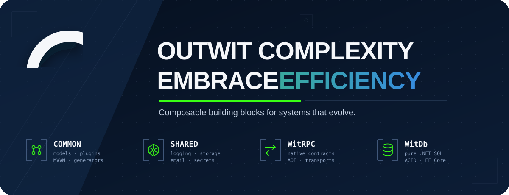

 

  

  
  
  
  

## Welcome

I'm **Dmitry Ratner**, a .NET architect and the author of the **OutWit ecosystem**. It is a growing collection of modules that I use to build desktop, web, service, and distributed applications.

The earliest parts date back to **2006**. Around **2012**, the separate libraries began to form an intentional modular system. It has kept evolving ever since, with new capabilities, regular refactoring, and plenty of production feedback.

## Why OutWit exists

Most applications need a familiar set of supporting capabilities: communication, persistence, logging, configuration, notifications, security, navigation, and deployment plumbing. Rebuilding that foundation for every project takes time and leaves less attention for the part that makes the product useful.

With OutWit, I can assemble a working application skeleton from modules, choose the providers that fit the deployment, and then spend most of the project on its actual domain logic.

Each reusable capability has a small contract. Concrete implementations live in separate packages and can be selected at the composition root. A product gets only the modules it needs, and a provider can change without sending vendor-specific code through the rest of the application.

This approach keeps changes local and makes the architecture easy to reuse. It also gives coding agents a clear map of the work: a contract, a reference implementation, a predictable project layout, and tests that describe when the job is done.

## The open-source foundation

<table>
  <tr>
    <td width="50%" valign="top">
      <h3><a href="https://github.com/dmitrat/WitRPC">⚡ WitRPC</a></h3>
      
<strong>Work with a remote object through a native C# contract.</strong>

      
Methods, properties, and events keep the shape of an ordinary .NET interface, so remote interaction feels much like using a local object. A server can start directly, with no required Kestrel or ASP.NET host. Transports and serializers are pluggable, and clients can target NativeAOT or Blazor WebAssembly.

      
<code>Native contracts</code> <code>WebSocket</code> <code>TCP</code> <code>IPC</code> <code>NativeAOT</code>

      
<a href="https://witrpc.io">Documentation</a> · <a href="https://www.nuget.org/packages/OutWit.Communication">NuGet</a>

    </td>
    <td width="50%" valign="top">
      <h3><a href="https://github.com/dmitrat/WitDatabase">◉ WitDatabase</a></h3>
      
<strong>A pure .NET relational file database.</strong>

      
ACID transactions, WAL recovery, MVCC, B+Tree and LSM storage, encryption, WitSQL, ADO.NET, and Entity Framework Core. IndexedDB storage also brings the database to Blazor WebAssembly.

      
<code>SQL</code> <code>ADO.NET</code> <code>EF Core</code> <code>ACID</code> <code>Blazor</code>

      
<a href="https://witdatabase.io">Documentation</a> · <a href="https://www.nuget.org/packages/OutWit.Database.EntityFramework">NuGet</a>

    </td>
  </tr>
  <tr>
    <td width="50%" valign="top">
      <h3><a href="https://github.com/dmitrat/Common">◆ OutWit.Common</a></h3>
      
<strong>The low-level application foundation.</strong>

      
Value-oriented models, MVVM for WPF and Avalonia, navigation, configuration, plugin discovery and isolation, source-generated proxies and controls, serialization helpers, logging, and testing utilities.

      
<code>ModelBase</code> <code>MVVM</code> <code>Plugins</code> <code>Source Generators</code>

      
<a href="https://github.com/dmitrat/Common#readme">Explore the packages</a>

    </td>
    <td width="50%" valign="top">
      <h3><a href="https://github.com/dmitrat/Shared">⬡ OutWit.Shared</a></h3>
      
<strong>Reusable infrastructure capabilities and provider contracts.</strong>

      
Vendor-neutral logging, email, messenger, blob-storage, secret-store, and Blazor-shell modules with reference providers for files, Loki, New Relic, SMTP, Resend, Telegram, disk storage, and native OS credential stores.

      
<code>Logging</code> <code>Email</code> <code>Messaging</code> <code>Storage</code> <code>Secrets</code>

      
<a href="https://github.com/dmitrat/Shared#readme">Explore the providers</a>

    </td>
  </tr>
  <tr>
    <td colspan="2" valign="top">
      <h3><a href="https://github.com/dmitrat/WitDocs">▤ WitDocs</a></h3>
      
<strong>A Blazor WebAssembly platform for content-driven static websites.</strong> It combines Markdown content, SEO support, and automatic content generation in a reusable application layer.

      
<code>Blazor WASM</code> <code>Markdown</code> <code>Static Sites</code> <code>SEO</code>

    </td>
  </tr>
</table>

## How the pieces fit

The ecosystem has a simple layered shape:

1. **Common** supplies small technical primitives and the plugin runtime.
2. **Shared** packages recurring infrastructure concerns as neutral contracts with replaceable providers.
3. **WitRPC** and **WitDatabase** provide substantial standalone subsystems without forcing a product architecture around them.
4. Applications compose only what they need and keep their domain logic outside the reusable foundation.

For example, a deployment can use PostgreSQL or an embedded database. Logging can go to local files, Loki, or New Relic. Email can use SMTP or Resend. These choices stay close to the application startup and packaging code.

## Built for composition, useful with agents

I started building OutWit long before coding agents appeared. The structure happens to suit them well because the intended path is visible in the repository:

- narrow contracts define the change boundary;
- a working provider acts as an executable example;
- predictable names reduce repository navigation;
- conformance tests define completion;
- independent packages keep the blast radius visible;
- deterministic builds and module layouts make results verifiable.

Agents are especially helpful with the routine coordination around small modules. They can follow dependency graphs, update package versions, reproduce provider layouts, run compatibility checks, and carry a mechanical change across several repositories. Good module boundaries still matter. They tell both a developer and an agent where a change belongs.

## Choose a starting point

| If you need… | Start with |
|---|---|
| A remote object that keeps its native C# contract | [WitRPC](https://github.com/dmitrat/WitRPC) |
| An embedded relational database without a native runtime | [WitDatabase](https://github.com/dmitrat/WitDatabase) |
| Plugin loading, MVVM, models, generators, or shared .NET utilities | [OutWit.Common](https://github.com/dmitrat/Common) |
| Replaceable logging, email, messaging, storage, secrets, or a Blazor shell | [OutWit.Shared](https://github.com/dmitrat/Shared) |
| A Markdown-driven static site built with Blazor | [WitDocs](https://github.com/dmitrat/WitDocs) |

## Open foundation

The repositories above are available under **Apache 2.0** and can be used in independent and commercial applications. I use the same libraries in my own commercial work, which gives the open components regular production use.

The reusable foundation stays public. Application-specific code remains with the applications where it belongs.

  <a href="https://ratner.io"><strong>ratner.io</strong></a>
  &nbsp;·&nbsp;
  <a href="https://www.linkedin.com/in/dmitrat"><strong>LinkedIn</strong></a>
  &nbsp;·&nbsp;
  <a href="https://www.nuget.org/profiles/dmitrat"><strong>NuGet</strong></a>

Built in .NET. Refined through real projects. Ready for the next one.

